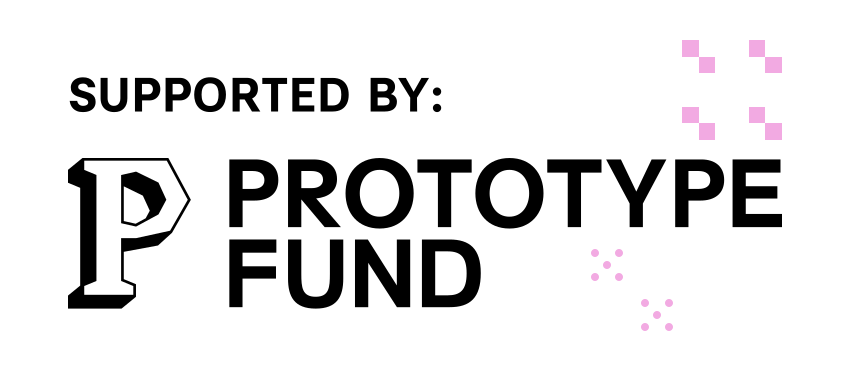

# CIVITAS demo data generator

Publishes believable fake sensor data so a freshly installed use case shows something
instead of an empty screen.

**Status:** proof of concept. The service works end to end against a broker; it is not
yet wired to the marketplace and not yet packaged for deployment.

## The one design rule

The generator emits **the use case's own data format**, exactly as a real device would:

```json
{ "counterId": "counter-001", "timestamp": "2026-07-31T12:58:51.343Z",
  "vehicleCount": 138, "avgSpeedKmh": 29.5, "direction": "inbound",
  "location": { "lat": 49.79, "lon": 9.93 } }
```

It does **not** emit SensorThings. Translating a device's format into SensorThings is
the pipeline's job (a `mapping` node), not the generator's. Keeping that boundary is
what makes a real sensor a drop-in replacement: point the device at the same topic and
delete the simulation — nothing else changes.

Consequence worth knowing: a pipeline **without** a mapping node runs in passthrough
mode and only accepts SensorThings, so it will ignore these messages. Mapped mode has
not been verified live yet — see `open-urban-apps-meta-planning/docs/exploration/
2026-07-28-demo-data-simulator-design.md`.

## Run

Start the broker, then the generator:

```bash
docker compose up -d
corepack pnpm install
corepack pnpm dev
```

Copy `.env.example` to `.env` first, so SQL simulations have somewhere to write;
`pnpm dev` and `pnpm start` load it automatically.

The generator listens on `:4300` (`PORT` to change it). The broker listens on
`localhost:1884` from your machine, and on `civitas-mosquitto:1883` from inside the
platform network — which is the address the marketplace writes into a demo install's
datasource, so NiFi finds it without any extra configuration.

## Authentication

The control API verifies a Keycloak token on every request, the same way the
platform's own backend does: the token itself is checked, rather than trusting a
header a gateway claims to have set.

It fails closed. The service refuses to start unless it is told either which
realm to trust (`AUTH_ISSUER_URL`) or, explicitly, that checking is off
(`SIMULATOR_AUTH_DISABLED=1`). The failure this prevents is a deployment that
accepts every caller because one variable was forgotten. Liveness stays open,
since probes carry no token.

`AUTH_REQUIRED_ROLE` additionally demands a realm or client role, once one
exists in the realm.

The marketplace sends a token too, as of 2026-09-14. It forwards the token of
whoever clicked rather than an identity of its own, because every one of its
calls happens inside an action that already required a session. So the simulator
records the person who acted, not a shared robot.

## The database

SQL simulations write rows into a database, and the platform polls those same
tables as a data source. The add-on ships that database rather than asking an
operator to supply an address: locally it is the `baumkataster-db` container in
`docker-compose.yml`, in a cluster it is `demo-source-db` in `deploy/demo.yaml`.

The generator reads exactly one variable, `DEMO_DB_DSN`, and has no default —
a wrong-but-plausible address is the failure this path exists to avoid. Without
it, every SQL simulation is refused with a message saying so.

An operator with a database of their own deletes the shipped one and points
`DEMO_DB_DSN` somewhere else. Nothing else changes.

## The broker

This repo ships a stock Mosquitto (`broker/mosquitto.conf` — configuration only, no
code). It runs as its own container rather than inside the Node process, because NiFi
holds a long-lived subscription to it: sharing a process would drop that subscription
on every generator restart, and "is my data flowing?" would be ambiguous after every
code change.

It is a **simulation-only** broker. We are not offering municipalities messaging
infrastructure for real sensors — they have their own, and its security, retention
and availability are not ours to own. Going live means repointing the datasource at
their broker; because the payload shape is identical, nothing else changes.

The dev stack must be up first, since the broker joins its `civitas-network`.

> Replaces `appstore-addon/demo-broker/docker-compose.yml`. Both use the container
> name `civitas-mosquitto`, so stop the old one before starting this:
> `docker compose -f ../appstore-addon/demo-broker/docker-compose.yml down`

## Deploying it

`deployment/` is the CIVITAS component: copy it into the deployment
repository's `components/` and add one line to the component list. It carries
its own chart, which deploys the control API, the web interface, and the broker
and database simulations write into. The last two are switchable for an
operator who already runs their own. See `deployment/README.md`.

## The UI

`ui/` is the add-on's own web interface: sign in with Keycloak, see every
simulation, switch them on and off, watch events arrive, and build or edit a
scenario field by field. It talks to the API below and to nothing else. See
`ui/README.md` to run it.

## API

| Method | Path | Purpose |
| --- | --- | --- |
| `PUT` | `/simulations/{id}` | Create or replace. Caller owns the id — the marketplace passes its dataset id |
| `GET` | `/simulations` | List, for reconciliation after a restart |
| `GET` | `/simulations/{id}` | Status, including `publishedCount` and `lastPayload`, plus the `input` it was registered with — what the UI edits |
| `DELETE` | `/simulations/{id}` | Stop and forget |
| `POST` | `/simulations/{id}/switch_on` · `/switch_off` | Pause and resume without losing the scenario |
| `GET` | `/simulations/{id}/sample?count=5` | Render without publishing |
| `POST` | `/sample` | Render an unregistered scenario — powers a catalogue preview |
| `GET` | `/healthz` | Liveness |

### Registering a simulation

```bash
curl -X PUT http://localhost:4300/simulations/my-dataset-id \
  -H 'Content-Type: application/json' \
  -d '{
    "transport": { "kind": "mqtt", "url": "mqtt://localhost:1884",
                   "topic": "civitas/musterhausen-trafficcounter" },
    "scenario": {
      "intervalSeconds": 10,
      "fields": {
        "counterId":    { "kind": "constant", "value": "counter-001" },
        "timestamp":    { "kind": "now" },
        "vehicleCount": { "kind": "dailyProfile", "min": 2, "max": 180,
                          "peakHours": [8, 17], "integer": true },
        "avgSpeedKmh":  { "kind": "randomWalk", "min": 5, "max": 60, "step": 3, "start": 30 },
        "direction":    { "kind": "enum", "values": ["inbound", "outbound"] },
        "location.lat": { "kind": "constant", "value": 49.79 },
        "location.lon": { "kind": "constant", "value": 9.93 }
      }
    }
  }'
```

Field keys are dotted paths, so nested payloads need no extra syntax.

### Generators

| Kind | Produces |
| --- | --- |
| `constant` | A fixed value |
| `now` | Current time, ISO-8601 |
| `enum` | One of `values`, at random |
| `randomWalk` | Drifts within `[min, max]`, at most `step` per tick. Stateful, so readings look related |
| `dailyProfile` | Follows the clock — low at night, peaking at `peakHours`. This is what makes data look real |
| `sequence` | `${prefix}${n}` — the only kind that can mint a unique key for a SQL table |
| `jitter` | Stateless scatter around `center`. The right kind for coordinates, which `randomWalk` would drag across the map |

## Design decisions

**Stateless.** Simulations live in memory only. The marketplace already holds the
install records, so persisting them here would be a second copy of the same truth, and
two copies eventually disagree. After a restart this service is empty and the
marketplace re-registers.

**`PUT` with a caller-supplied id.** Uninstall can `DELETE /simulations/{datasetId}`
with no lookup table, and a retry converges instead of starting a second publisher.

**A unique MQTT client id per simulation.** NiFi's own consumer uses a fixed client id
and its flows visibly kick each other off the broker with "session taken over". Two
publishers sharing an id would do the same, and the symptom — messages silently
stopping — is miserable to debug.

**Capped at 50 simulations.** A demo tool must not be able to flood a municipal broker.

## Not done yet

- An event channel (Server-Sent Events) so the UI can show a true live stream
  instead of polling `lastPayload`
- Deciding where "this is simulated" belongs. The current answer is a
  `simuliert` column the SQL writer adds to every row, which sits badly against
  this repo's one design rule: a real device is meant to be a drop-in
  replacement, and it would never send that column. The likelier right answer is
  the metadata layer — the dataset says it carries demo data, and neither the
  rows nor the messages are touched. That would also remove the column rather
  than add a matching flag to MQTT payloads.
- No role is demanded yet: any signed-in person may change simulations. The
  service supports `AUTH_REQUIRED_ROLE`, but no such role exists in the realm
- Verifying mapped mode live, which is what makes these payloads ingestible

## Funding

This project is funded by the **Federal Ministry of Research, Technology and Space (BMFTR)** as part of the **[Prototype Fund](https://prototypefund.de/)**, an initiative by the Open Knowledge Foundation Germany. 

<div style="display: flex; gap: 20px; align-items: center; margin-top: 20px;">
  <a href="https://www.bmbf.de/" target="_blank"></a>
  <a href="https://prototypefund.de/" target="_blank"></a>
</div>
